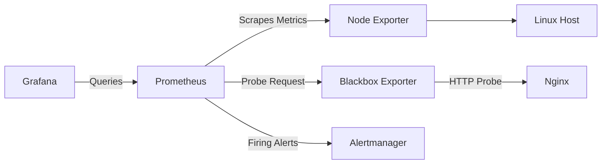

# IT Infrastructure Monitoring and Alerting System

A containerized infrastructure monitoring and alerting environment built with **Prometheus, Grafana, Alertmanager, Node Exporter, Blackbox Exporter, Nginx and Docker Compose**.

The project monitors Linux system resources and HTTP service availability, visualizes collected metrics through Grafana, and generates alerts when abnormal conditions or service outages are detected.

> This project was developed entirely in a local lab environment. No corporate infrastructure, production systems, or confidential company data were used.

---

## Overview

The system provides:

- Linux host monitoring
- CPU, memory, disk and network metrics
- Real-time Grafana dashboards
- Host availability monitoring
- HTTP service availability monitoring
- Prometheus alert rules
- Alertmanager integration
- Failure simulation and recovery testing
- Automatic Grafana datasource provisioning
- Automatic Grafana dashboard provisioning

---

## Architecture



The monitoring flow is based on three main scenarios:

```text
Linux Host
    ↓
Node Exporter
    ↓
Prometheus
    ↓
Grafana
```

```text
Nginx
    ↑
Blackbox Exporter
    ↑
Prometheus
```

```text
Infrastructure Problem
    ↓
Prometheus Alert Rule
    ↓
Alertmanager
```

---

## Technologies

| Technology | Purpose |
| --- | --- |
| Linux Mint | Host operating system |
| Docker | Container runtime |
| Docker Compose | Multi-container orchestration |
| Prometheus | Metrics collection and alert evaluation |
| Grafana | Metrics visualization and dashboards |
| Alertmanager | Alert management and routing |
| Node Exporter | Linux host metrics |
| Blackbox Exporter | HTTP service availability monitoring |
| Nginx | Test HTTP service |
| PromQL | Prometheus query language |
| stress-ng | Controlled CPU load testing |

---

## Monitored Metrics

The Grafana dashboard provides visibility into:

- Host Status
- Nginx Service Status
- System Uptime
- CPU Usage
- Memory Usage
- Disk Usage
- Network Receive Traffic
- Network Transmit Traffic

The dashboard is automatically provisioned when Grafana starts.

---

## Alert Rules

### NodeExporterDown

Detects loss of communication between Prometheus and Node Exporter.

```text
Condition:
Node Exporter unavailable for 30 seconds

Severity:
Critical
```

---

### HighCPUUsage

Detects sustained high CPU utilization.

```text
Condition:
CPU Usage > 80% for 30 seconds

Severity:
Warning
```

---

### ServiceDown

Detects HTTP service outages using Blackbox Exporter.

```text
Condition:
probe_success = 0 for 30 seconds

Severity:
Critical
```

---

## Failure Scenarios Tested

Multiple failure scenarios were manually simulated to verify the monitoring and alerting workflow.

### 1. Node Exporter Failure

Node Exporter was stopped manually.

Expected behavior:

```text
Node Exporter
     ↓
    DOWN
     ↓
Prometheus detects scrape failure
     ↓
NodeExporterDown
     ↓
FIRING
     ↓
Alertmanager
```

After Node Exporter was restarted, the target returned to the `UP` state and the alert was automatically resolved.

---

### 2. High CPU Usage

Controlled CPU load was generated using `stress-ng`.

Example:

```bash
stress-ng --cpu 0 --cpu-load 90 --timeout 120s --metrics-brief
```

Expected behavior:

```text
CPU Usage > 80%
      ↓
30 seconds
      ↓
HighCPUUsage
      ↓
FIRING
      ↓
Alertmanager
```

After the load test ended, CPU utilization returned to normal and the alert became inactive.

---

### 3. HTTP Service Failure

The Nginx container was stopped manually.

```bash
docker stop nginx
```

Blackbox Exporter detected the outage:

```text
probe_success = 0
```

The following alert flow was verified:

```text
Nginx DOWN
    ↓
Blackbox Exporter
    ↓
probe_success = 0
    ↓
Prometheus
    ↓
ServiceDown
    ↓
FIRING
    ↓
Alertmanager
```

After restarting Nginx:

```bash
docker start nginx
```

Blackbox Exporter returned:

```text
probe_success = 1
```

and the alert automatically returned to the inactive state.

---

## Project Structure

```text
infrastructure-monitoring/
│
├── alertmanager/
│   └── alertmanager.yml
│
├── blackbox/
│   └── blackbox.yml
│
├── grafana/
│   ├── dashboards/
│   │   └── linux-infrastructure-monitoring.json
│   │
│   └── provisioning/
│       ├── dashboards/
│       │   └── dashboards.yml
│       │
│       └── datasources/
│           └── prometheus.yml
│
├── prometheus/
│   ├── alerts.yml
│   └── prometheus.yml
│
├── compose.yaml
├── .gitignore
└── README.md
```

---

## Prerequisites

The project is intended to run on a Linux host with:

- Docker Engine
- Docker Compose plugin
- Git

`stress-ng` is optional and is only required for the CPU alert test.

---

## Running the Project

Clone the repository:

```bash
git clone https://github.com/KMEvciman/infrastructure-monitoring.git
cd infrastructure-monitoring
```

Validate the Docker Compose configuration:

```bash
docker compose config
```

Start the complete monitoring stack:

```bash
docker compose up -d
```

Check the running services:

```bash
docker compose ps
```

The following containers should be running:

```text
prometheus
node-exporter
grafana
alertmanager
blackbox-exporter
nginx
```

To stop the stack:

```bash
docker compose down
```

---

## Web Interfaces

| Service | Address | Port |
| --- | --- | ---: |
| Grafana | `http://localhost:3000` | 3000 |
| Prometheus | `http://localhost:9090` | 9090 |
| Alertmanager | `http://localhost:9093` | 9093 |
| Node Exporter | `http://localhost:9100/metrics` | 9100 |
| Blackbox Exporter | `http://localhost:9115` | 9115 |
| Nginx | `http://localhost:8080` | 8080 |

---

## Grafana Provisioning

Grafana is configured using file-based provisioning.

The Prometheus datasource is automatically configured when Grafana starts.

The dashboard is stored at:

```text
grafana/dashboards/linux-infrastructure-monitoring.json
```

The dashboard provider configuration is stored at:

```text
grafana/provisioning/dashboards/dashboards.yml
```

This means the monitoring dashboard can be recreated automatically without manually rebuilding each panel.

---

## Configuration Validation

Prometheus configuration and alert rules can be validated using `promtool`:

```bash
docker run --rm \
  --entrypoint promtool \
  -v "$PWD/prometheus:/etc/prometheus:ro" \
  prom/prometheus:latest \
  check config /etc/prometheus/prometheus.yml
```

A successful configuration returns:

```text
SUCCESS: 3 rules found
```

Alertmanager configuration can be validated using:

```bash
docker run --rm \
  --entrypoint amtool \
  -v "$PWD/alertmanager:/etc/alertmanager:ro" \
  prom/alertmanager:latest \
  check-config /etc/alertmanager/alertmanager.yml
```

---

## Health Checks

Prometheus readiness:

```bash
curl http://localhost:9090/-/ready
```

Expected result:

```text
Prometheus Server is Ready.
```

Alertmanager readiness:

```bash
curl http://localhost:9093/-/ready
```

Expected result:

```text
OK
```

Nginx HTTP check:

```bash
curl -I http://localhost:8080
```

Expected result:

```text
HTTP/1.1 200 OK
```

Blackbox Exporter HTTP probe:

```bash
curl -s \
  "http://localhost:9115/probe?target=http://nginx:80&module=http_2xx" \
  | grep '^probe_success'
```

Expected result:

```text
probe_success 1
```

---

## Final System Validation

The completed environment was successfully tested with:

```text
Docker Services        → UP
Prometheus Config      → VALID
Alert Rules            → 3 VALID RULES
Alertmanager Config    → VALID
Prometheus Readiness   → READY
Alertmanager Readiness → OK
Nginx HTTP             → 200 OK
Blackbox Probe         → SUCCESS
Grafana Dashboard      → ACTIVE
Host Failure Alert     → VERIFIED
High CPU Alert         → VERIFIED
HTTP Service Alert     → VERIFIED
Alert Recovery         → VERIFIED
```

---

## Project Purpose

The purpose of this project is to demonstrate the design and implementation of a small-scale **Infrastructure Monitoring and Alerting System** using widely used open-source technologies.

The project demonstrates practical experience with:

- Infrastructure monitoring
- Linux system metrics
- Containerized services
- Time-series monitoring
- PromQL queries
- Dashboard design
- Service availability monitoring
- Alert rule configuration
- Failure simulation
- Incident detection and recovery

The environment is completely isolated from corporate production systems and can be recreated locally using Docker Compose.

---

## Notes

This project is designed for educational and local lab usage.

The exposed service ports should not be made publicly accessible in a production environment without appropriate security controls such as authentication, firewall rules, TLS and reverse proxy configuration.
